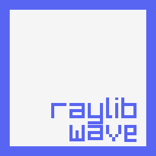

# raylib-wave

Wave bindings for raylib 5.5.0.
This library allows you to develop games using raylib with the Wave programming language.

## Requirements

- A current `wavec` with `--link` support
- raylib: 5.5.0
- Operating System: Linux (Fedora 43 recommended)

---

## Getting Started

### 1. Clone the repository

You can either clone the repository or copy the `raylib.wave` file directly into your project.

```bash
git clone https://github.com/wavefnd/raylib-wave.git
```

### 2. Install raylib

Install raylib 5.5.0 on your system.
On Fedora:
```bash
sudo dnf install raylib-devel
```

> Make sure `libraylib.so` is available in your system library path.

### 3. Import raylib in Wave

Import `raylib.wave` in your Wave source file:

```wave
import("raylib");
```

You can now use raylib APIs directly from Wave.

### 4. Build and link

`raylib` is a library name, not a linker executable. Keep Wave's default linker and pass the library with `--link=raylib`:

```bash
wavec --link=raylib build examples/example.wave -o target/example
./target/example
```

The included Makefile obtains raylib search paths and library names from `pkg-config` and converts `-lraylib` to Wave's `--link=raylib` form.

```bash
make
make run EXAMPLE=example
make run EXAMPLE=shapes
make check
make print-config
```

Use `WAVEC=/path/to/wavec` to select another compiler. `RAYLIB_PACKAGE` can override the `pkg-config` package name, and `RAYLIB_LINK_FLAGS` can override all detected Wave linker flags.

---

## Example


<br />

```wave
import("raylib");

fun main() {
    var screenWidth: i32 = 800;
    var screenHeight: i32 = 450;
    InitWindow(screenWidth, screenHeight, "raylib [core] example - basic window");

    SetTargetFPS(60);

    var raywhite: Color = Color { r: 245, g: 245, b: 245, a: 255 };
    var lightgray: Color = Color { r: 200, g: 130, b: 130, a: 255 };

    while(WindowShouldClose() == 0) {
        BeginDrawing();

        ClearBackground(raywhite);

        DrawText("Congrats! You created your first window!", 190, 200, 20, lightgray);

        EndDrawing();
    }

    CloseWindow();
}
```

---

## License

This project follows the same license as the Zlib.
See the repository for more details.
